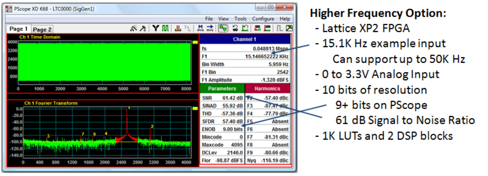

# ADC evaluation tool

Tiny tools collection (Python [NumPy](https://numpy.org/)+[Matplotlib](https://matplotlib.org/) based) to do spectral analysis and calculate the key performance parameters of an ADC. Just collect some data from the ADC, specify basic ADC parameters and run analysis. See [example.ipynb](example.ipynb) (you will need [Jupyter Notebook](https://jupyter.org/) to be installed).

References:
- [Analog Devices MT-003 TUTORIAL "Understand SINAD, ENOB, SNR, THD, THD + N, and SFDR so You Don't Get Lost in the Noise Floor"](https://www.analog.com/media/en/training-seminars/tutorials/MT-003.pdf)
- [National Instruments Application Note 041 "The Fundamentals of FFT-Based Signal Analysis and Measurement"](http://www.sjsu.edu/people/burford.furman/docs/me120/FFT_tutorial_NI.pdf)

Inspired by Linear Technology (now Analog Devices) [PScope](https://www.analog.com/en/technical-articles/pscope-basics.html) tool.

Image source: [Creating an ADC Using FPGA Resources WP - Lattice](https://www.latticesemi.com/-/media/LatticeSemi/Documents/WhitePapers/AG/CreatingAnADCUsingFPGAResources.ashx?document_id=36525)
